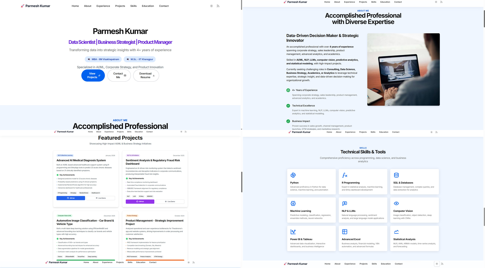
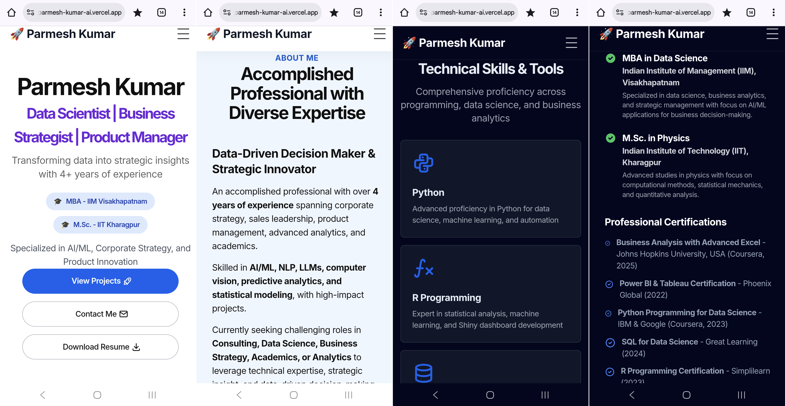
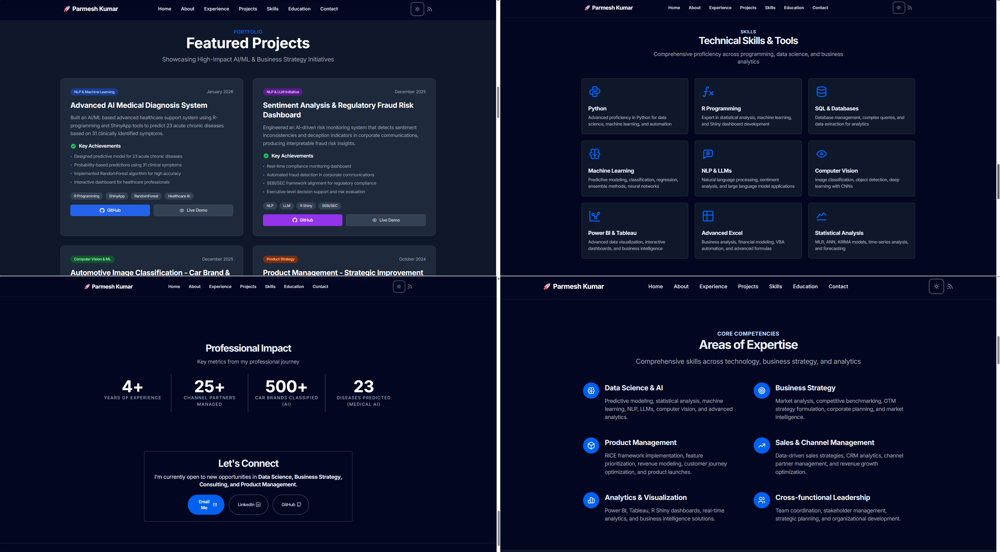

# 🚀 Parmesh Kumar - Professional Portfolio

[](https://parmesh-kumar-ai.vercel.app)
[](LICENSE.md)
[](https://astro.build)

> A modern, responsive portfolio website showcasing my journey as a Data Scientist, Business Strategist, and Product Manager.

## 👨‍💼 About Me

Data Scientist and Business Strategist with 4+ years of experience in corporate strategy, AI/ML, product management, and advanced analytics. Passionate about transforming data into strategic insights.

- 🎓 **MBA in Data Science** - IIM Visakhapatnam
- 🎓 **M.Sc. in Physics** - IIT Kharagpur
- 💼 Currently: **Chief Strategy Officer** at Biomexia Healthcare
- 🌐 **Portfolio (live)**: [visit here](https://parmesh-kumar-ai.vercel.app)

---

## ✨ Features

- 🎨 **Modern Design** - Clean, professional, and visually appealing
- 📱 **Fully Responsive** - Optimized for desktop, tablet, and mobile
- 🌙 **Dark Mode** - Toggle between light and dark themes
- ⚡ **Fast Performance** - Built with Astro for optimal speed
- 🎯 **Interactive UI** - Smooth animations and hover effects
- 📊 **Project Showcase** - 4 featured AI/ML projects with detailed descriptions
- 💼 **Experience Timeline** - Interactive career journey visualization
- 🎓 **Education & Certifications** - Academic excellence and professional credentials
- 📧 **Contact Section** - Easy ways to get in touch

---

## 🛠️ Tech Stack

### **Frontend Framework**
- [Astro](https://astro.build) - Modern static site generator
- [Tailwind CSS](https://tailwindcss.com) - Utility-first CSS framework
- TypeScript - Type-safe JavaScript

### **Components & UI**
- Custom Astro Components
- Responsive Navigation
- Interactive Timeline
- Project Cards with Hover Effects

### **Deployment**
- [Vercel](https://vercel.com) - Serverless deployment platform
- Automatic CI/CD from GitHub

---

## 📂 Project Structure

```
portfolio/
├── public/
│   ├── images/          # Images and assets
│   └── resume.pdf       # Downloadable resume
├── src/
│   ├── components/      # Reusable Astro components
│   │   └── widgets/     # Header, Footer, Hero, etc.
│   ├── layouts/         # Page layouts
│   ├── pages/           # Route pages
│   │   └── index.astro  # Main homepage
│   ├── styles/          # Global styles
│   └── navigation.js    # Navigation configuration
├── astro.config.mjs     # Astro configuration
├── tailwind.config.js   # Tailwind CSS configuration
├── package.json         # Dependencies
└── README.md           # This file
```

---

## 🚀 Getting Started

### **Prerequisites**

- Node.js 18+ installed
- npm or yarn package manager

### **Installation**

1. **Clone the repository**
   ```bash
   git clone https://github.com/parmesh-kumar-ai/portfolio.git
   cd portfolio
   ```

2. **Install dependencies**
   ```bash
   npm install
   ```

3. **Run development server**
   ```bash
   npm run dev
   ```

4. **Open in browser**
   ```
   http://localhost:4321
   ```

### **Build for Production**

```bash
npm run build
```

The built site will be in the `dist/` folder.

### **Preview Production Build**

```bash
npm run preview
```

---

## 📝 License

This project is licensed under the MIT License - see the [LICENSE](LICENSE) file for details.

---

## 🙏 Acknowledgments

- Built with [AstroWind](https://github.com/onwidget/astrowind) template
- Icons from [Tabler Icons](https://tabler-icons.io/)
- Deployed on [Vercel](https://vercel.com)

---

## 📊 Project Status

- ✅ **Live**: Portfolio is deployed and accessible
- ✅ **Maintained**: Regularly updated with new projects and skills
- ✅ **Open to Opportunities**: Currently seeking roles in Data Science, Business Strategy, Consulting, and Product Management

---

<div align="center">

### ⭐ If you like this portfolio, give it a star!

**Made by [Parmesh Kumar](https://github.com/parmesh-kumar-ai)**

</div>

---

## 📱 Screenshots

### Desktop View


### Mobile View


### Dark Mode


---

## 🔗 Quick Links

- 📧 **Email**: [parmesh.kumar.ai@gmail.com](mailto:parmesh.kumar.ai@gmail.com)
- 💼 **LinkedIn**: [linkedin.com/in/parmesh-kumar-ai](https://linkedin.com/in/parmesh-kumar-ai)
- 🐱 **GitHub**: [github.com/parmesh-kumar-ai](https://github.com/parmesh-kumar-ai)
- 🎨 **Behance**: [behance.net/parmesh-kumar-ai](https://behance.net/parmesh-kumar-ai)
